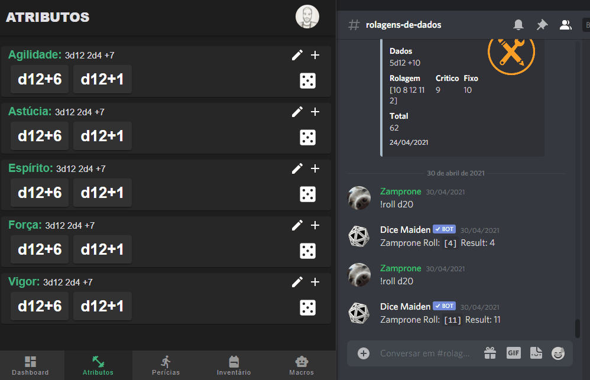

# RPG

  

  

Este sistema consiste em uma interface web, um bot para o Discord e uma API para alimentar e persistir as interações de ambos.

A autenticação é feita através do Discord usando como base os usuário de um servidor específico, os cargos deste mesmo servidor são usados para gerenciar as permissões do usuário em todo o sistema.

  

Para saber maiores detalhes do funcionamento acesse:

<ul>
  <li>
    <a href="https://github.com/steferson-augusto/rpg/tree/develop/server" target="_blank">API</a>
  </li>
  <li>
    <a href="https://github.com/steferson-augusto/rpg/tree/develop/web" target="_blank">Web</a>
  </li>
</ul>