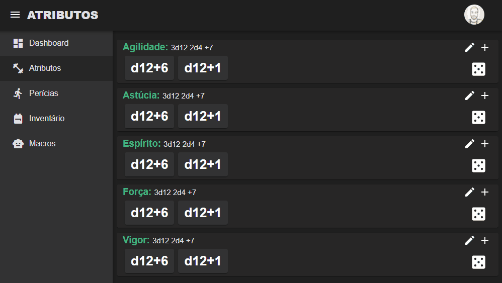
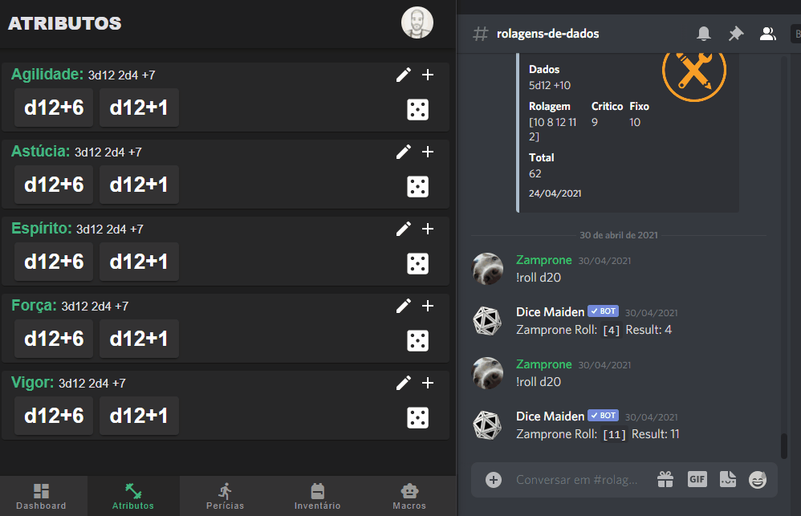
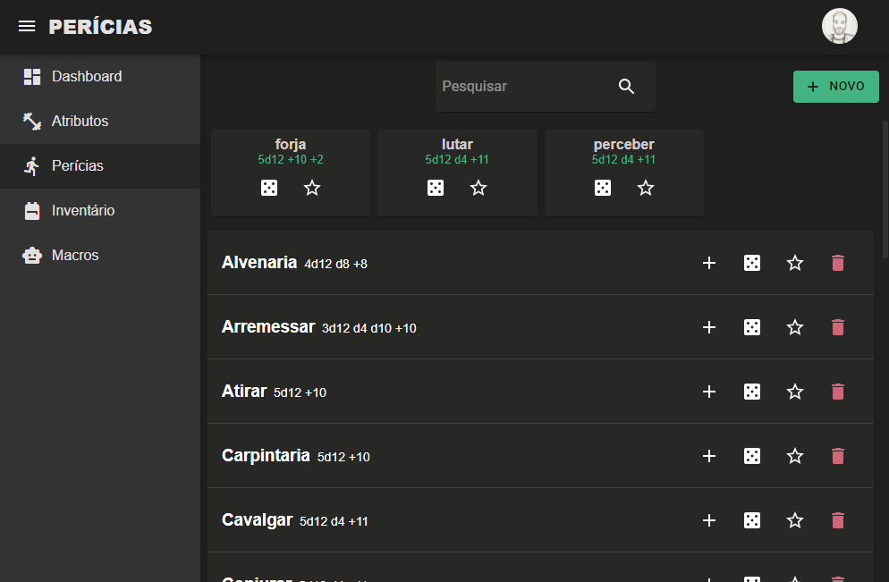
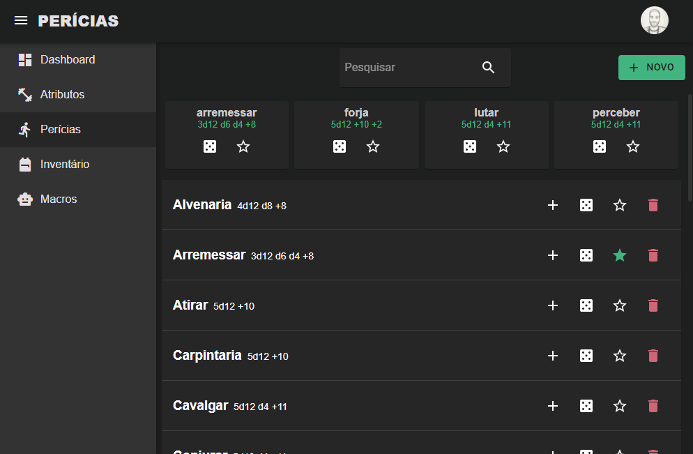
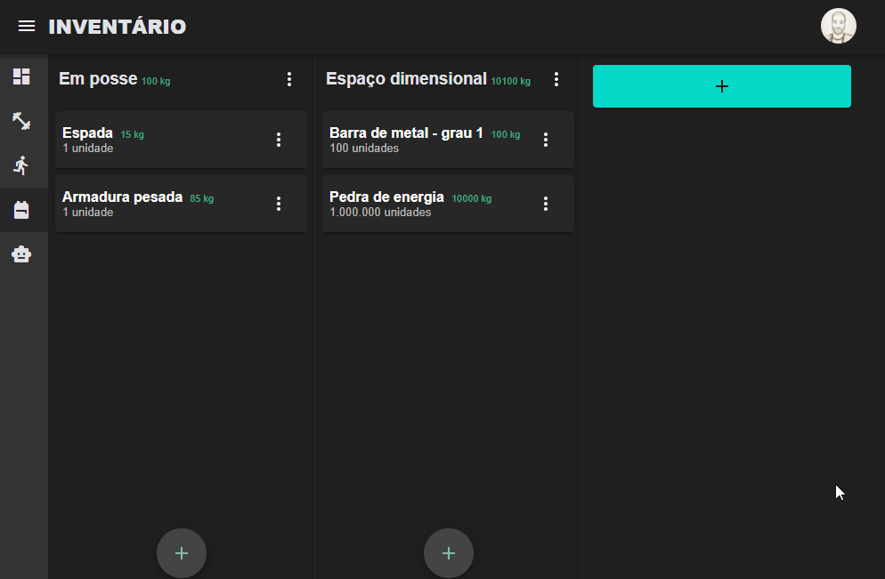

<h1 align="center">RPG - WEB</h1>

  Projeto escrito em React JS e Typescript

<h4 align="center">
  <a href="#dashboard" >
    Dashboard
  </a>
  |
  <a href="#attributes" >
    Atributos
  </a>
  |
  <a href="#skills" >
    Perícias
  </a>
  |
  <a href="#items" >
    Inventário
  </a>
  |
  <a href="#macros" >
    Macros
  </a>
</h4>

 
<h2 name="dashboard">🚧 Dashboard</h2>

  Em construção.

 
<h2 name="attributes">💪 Atributos</h2>

Gerenciamento e rolagem de atributos.

  

 

As rolagens são integradas ao nosso servidor Discord.

  

 
<h2 name="skills">🏹 Perícias</h2>

Gerenciamento de perícias.

  

 

Marcar perícias favoritas.

  

 
<h2 name="items">🎒 Inventário</h2>

Gerenciamento de itens.

  

 
<h2 name="macros">🚧 Macros</h2>

  Em construção.

 
<h2 name="license">📝 Licença</h2>

Este projeto está sob uma licença MIT. Veja mais informações em <a href="https://github.com/steferson-augusto/rpg/blob/develop/LICENSE" target="_blank">LICENSE</a>.

---

👻 Criado por <a href="https://www.linkedin.com/in/st%C3%A9ferson-augusto-4b0b9b124/" target="_blank">Stéferson Augusto</a>

